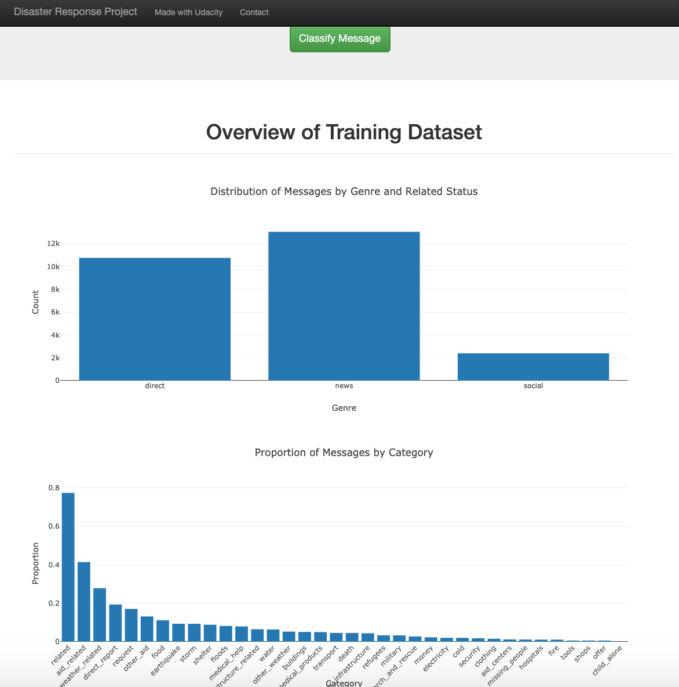
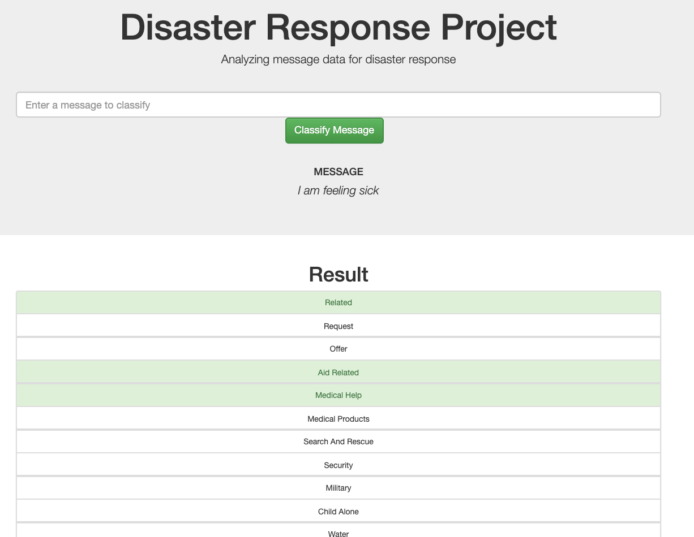

# Disaster Response Pipeline Project

This project to showcase Data Engineering skills including ETL and ML Pipeline preparation, utilising model in a Flask web app, and data visualisation.

## Project Description
In this project, we will build a model to classify messages that are sent during disasters. There are 36 pre-defined categories, and examples of these categories include Aid Related, Medical Help, Search And Rescue, etc. By classifying these messages, we can allow these messages to be sent to the appropriate disaster relief agency. This project will involve the building of a basic ETL and Machine Learning pipeline to facilitate the task. This is also a multi-label classification task, since a message can belong to one or more categories. 

### Instructions:
1. Run the following commands in the project's root directory to set up your database and model.

    - To run ETL pipeline that cleans data and stores in database
        `python data/process_data.py data/disaster_messages.csv data/disaster_categories.csv data/DisasterResponse.db`
    - To run ML pipeline that trains classifier and saves
        `python models/train_classifier.py data/DisasterResponse.db models/classifier.pkl`

2. Run the following command in the app's directory to run your web app.
    `python run.py`
    
3. Go to http://0.0.0.0:3001/

    
This project contains a web app where you can input a message and get classification results.

### Screenshots

Main page

   
     

After providinga text to classify:

 
